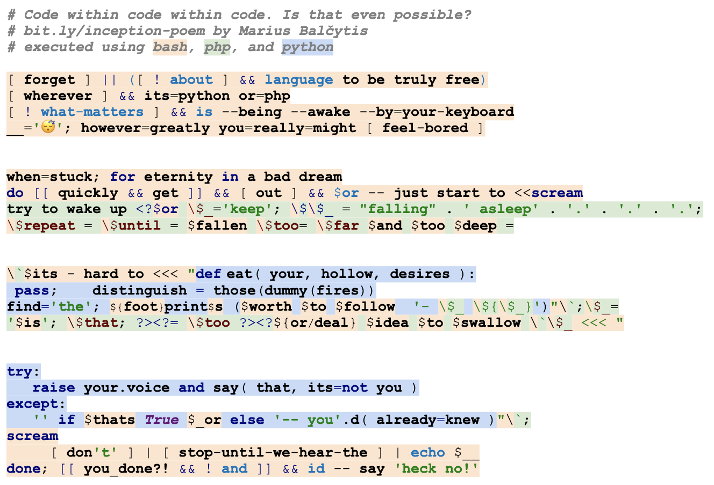

# Inception poem

Code within code within code. Is that even possible?

This is a poem written as a submission for the [Source Code Poetry](http://sourcecodepoetry.com/) competition.



## Executing

To execute the poem you will need all three: bash, python, and PHP.

If you're fancy enough to have a Mac or geeky enough to use Linux, with any luck it will work by
[copy-pasting](poem.sh) straight into the terminal. Luck here has to do with having `php` and `python` installed,
as well as using `bash` not only as the default shell, but also as the `sh` replacement.

Otherwise, or just because you can, execute it using docker:
```bash
docker run --rm -it -v `pwd`:/code -w /code --env SHELL=/bin/bash villers/docker-php-python-node sh -c 'cp /bin/bash /bin/sh && ./poem.sh'
```

If you like spoilers or are just lazy, head on [here](execution.png).

## Other submissions

If you lack motivation for better things to do,
see [my previous submissions](https://github.com/search?q=user%3Amariusbalcytis+poem).
